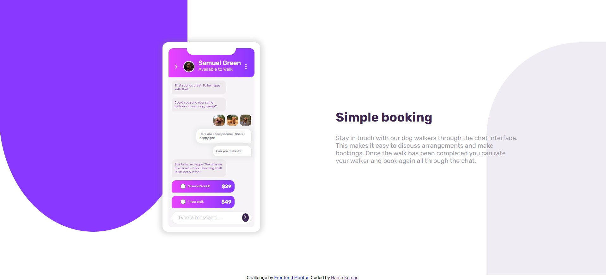

# Frontend Mentor - Chat app CSS illustration solution

This is a solution to the [Chat app CSS illustration challenge on Frontend Mentor](https://www.frontendmentor.io/challenges/chat-app-css-illustration-O5auMkFqY). Frontend Mentor challenges help you improve your coding skills by building realistic projects. 

## Table of contents

- [Overview](#overview)
  - [The challenge](#the-challenge)
  - [Screenshot](#screenshot)
  - [Links](#links)
- [My process](#my-process)
  - [Built with](#built-with)
  - [What I learned](#what-i-learned)
- [Author](#author)

## Overview

### The challenge

Users should be able to:

- View the optimal layout for the component depending on their device's screen size
- **Bonus**: See the chat interface animate on the initial load

### Screenshot

### Links

- Solution URL: [Solution url](https://www.frontendmentor.io/solutions/chatappillustration-6qfYvpLvBO)
- Live Site URL: [Live site](https://lucky-salamander-e86340.netlify.app/)

## My process

### Built with

- Semantic HTML5 markup
- CSS custom properties
- Flexbox
- Grid
- Mobile-first workflow

### What I learned

I learned input selectors and differenct grid alignments on completing this project.

## Author

- Website - [Harsh Kumar](https://github.com/thisisharsh7)
- Frontend Mentor - [@thisisharsh7](https://www.frontendmentor.io/profile/thisisharsh7)
- Twitter - [@thisisharsh7](https://www.twitter.com/thisisharsh7)