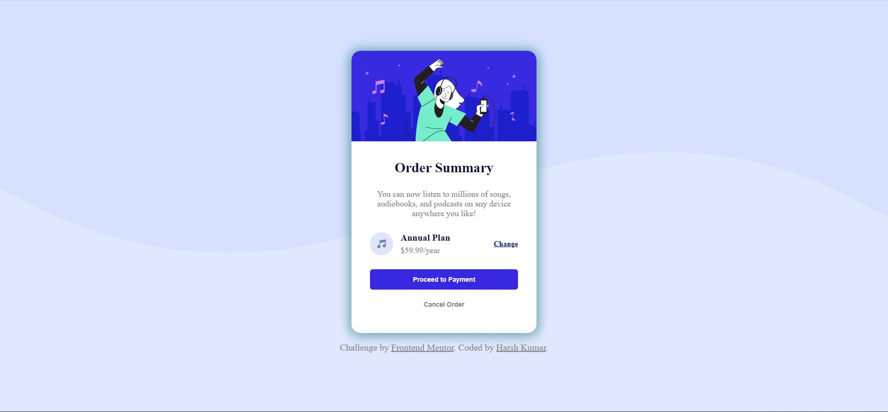

# Frontend Mentor - Order summary card solution

This is a solution to the [Order summary card challenge on Frontend Mentor](https://www.frontendmentor.io/challenges/order-summary-component-QlPmajDUj). Frontend Mentor challenges help you improve your coding skills by building realistic projects.

## Table of contents

- [Overview](#overview)
  - [The challenge](#the-challenge)
  - [Screenshot](#screenshot)
  - [Links](#links)
- [My process](#my-process)
  - [Built with](#built-with)
  - [What I learned](#what-i-learned)
- [Author](#author)

## Overview

### The challenge

Users should be able to:

- See hover states for interactive elements

### Screenshot



### Links

- Solution URL: [Add solution URL here](https://your-solution-url.com)
- Live Site URL: [Add live site URL here](https://your-live-site-url.com)

## My process

### Built with

- Semantic HTML5 markup
- CSS custom properties
- Flexbox
- CSS Grid
- Mobile-first workflow

### What I learned

While building this project I learned about flex gap and alignment property. I also learned about the custom background property in css.

```html
<main>
  <div id="card-body">
    
    <div id="card-txt">
      <p id="heading">Order Summary</p>
      <p id="info">
        You can now listen to millions of songs, audiobooks, and podcasts on any
        device anywhere you like!
      </p>
      <div id="card-plan">
        <div id="detail">
          
          <div id="plan-money">
            <p id="plan">Annual Plan</p>
            <p id="money">$59.99/year</p>
          </div>
        </div>
        <a href="#" id="change">Change</a>
      </div>
      <div id="btn-c">
        <button id="proceed-btn" class="btn">Proceed to Payment</button>
        <button id="cancel-btn" class="btn">Cancel Order</button>
      </div>
    </div>
  </div>
</main>

<footer>
  <div class="attribution">
    Challenge by
    <a href="https://www.frontendmentor.io?ref=challenge" target="_blank"
      >Frontend Mentor</a
    >. Coded by
    <a href="https://www.frontendmentor.io/profile/thisisharsh7">Harsh Kumar</a
    >.
  </div>
</footer>
```

```css
* {
  margin: 0;
  padding: 0;
  text-align: center;
  color: gray;
}
body {
  font-size: 16px;
  width: 100vw;
  height: 100vh;
  display: flex;
  flex-direction: column;
  align-items: center;
  justify-content: center;
  background: repeat-x hsl(225, 100%, 94%) url("./images/pattern-background-desktop.svg")
    top;
}
#card-body {
  display: flex;
  flex-direction: column;
  width: 20rem;
  background-color: white;
  border-radius: 1rem;
  box-shadow: 0px 1px 18px 5px rgba(45, 125, 128, 0.59);
}
#hero-img {
  border-top-right-radius: 1rem;
  border-top-left-radius: 1rem;
}
#card-txt {
  padding: 2rem;
  display: flex;
  flex-direction: column;
  align-items: center;
  gap: 1.5rem;
}
#card-plan {
  display: flex;
  width: 100%;
  justify-content: space-between;
  align-items: center;
}
#music-icon {
  width: 2.5rem;
}
#detail {
  display: flex;
  gap: 0.8rem;
}
#plan-money {
  display: flex;
  flex-direction: column;
  justify-content: space-between;
}
#plan {
  color: rgb(16, 16, 56);
  font-weight: bold;
}
#money {
  align-self: flex-start;
  font-size: 0.9rem;
}
.btn {
  width: 100%;
  border-radius: 0.3rem;
  font-weight: 600;
  font-size: 0.7rem;
  padding: 0.7rem;
  border: none;
  background-color: white;
}
.btn:hover {
  cursor: pointer;
}
#proceed-btn {
  background-color: hsl(245, 75%, 52%);
  color: white;
}
#cancel-btn {
  color: gray;
}
#cancel-btn:hover {
  color: rgb(16, 16, 56);
}
#proceed-btn:hover {
  background-color: hsl(224, 23%, 55%);
}
#change {
  font-weight: 600;
  font-size: 0.8rem;
  color: rgb(0, 11, 128);
}
#change:hover {
  text-decoration: none;
  color: hsl(224, 23%, 55%);
}
#btn-c {
  display: flex;
  width: 100%;
  flex-direction: column;
  gap: 0.5rem;
}
#heading {
  color: rgb(16, 16, 56);
  font-weight: bolder;
  font-size: 1.5rem;
}
#info {
  font-size: 0.9rem;
}
footer {
  padding: 1rem;
}
```

## Author

- Website - [Harsh Kumar](https://github.com/thisisharsh7)
- Frontend Mentor - [@thisisharsh7](https://www.frontendmentor.io/profile/thisisharsh7)
- Twitter - [@thisisharsh7](https://www.twitter.com/thisisharsh7)
